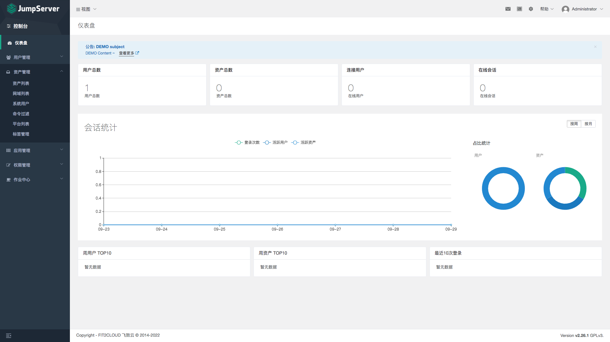

# 系统结构

 获取 `linux` 操作系统的位数 `getconf LONG_BIT`

## 一、KVM

### 1.1 安装

```bash
# CentOS Linux release 7.5.1804 (Core)

egrep 'vmx|svm' /proc/cpuinfo

yum install -y -q \
    qemu-kvm qemu-img \
    virt-manager libvirt libvirt-python python-virtinst libvirt-client \
    virt-install virt-viewer

lsmod | grep -i kvm

brctl show

# virsh net-list

systemctl start libvirtd
systemctl enable libvirtd
systemctl is-enabled libvirtd

cd /etc/sysconfig/network-scripts/
# 编辑 ifcfg-em2 & ifcfg-br0
cat > ifcfg-br0 <<EOF
TYPE=Bridge
BOOTPROTO=static
NAME=br0
DEVICE=br0
ONBOOT=yes
IPADDR=10.1.2.109
PREFIX=24
EOF

cat > ifcfg-em2 <<EOF
TYPE=Ethernet
BOOTPROTO=none
NAME=em2
DEVICE=em2
ONBOOT=yes
BRIDGE=br0
EOF

# 激活网卡
ip l set br0 up # ifup br0
ip l set em2 up # ifup em2

# systemctl restart NetworkManager
systemctl restart network

# 释放多余的桥接和网络接口
ip l set dev virbr0-nic down
brctl delif virbr0 virbr0-nic
brctl delbr virbr0

ip l set dev virbr0 down
ip l del virbr0-nic

# METHOD VNC
virt-install --name UAT-BIGDATA-000 \
    --virt-type kvm \
    --ram=8192 \
    --vcpus=2 \
    --cdrom=/data/backup/CentOS-7-x86_64-DVD-2009.iso \
    --disk path=/data/lib/kvm/UAT-BIGDATA-001/UAT-BIGDATA-000-SDA.raw \
    --network bridge=br0 \
    --graphics vnc,listen=0.0.0.0 \
    --noautoconsole

virt-install --name UAT-BIGDATA-000 \
    --virt-type kvm  \
    --ram 4096 \
    --vcpus 2 \
    --boot hd \
    --disk path=/data/lib/kvm/UAT-BIGDATA-001/UAT-BIGDATA-000-SDA.qcow2 \
    --mac=52:54:0A:01:02:32 \
    --network bridge=br1 \
    --graphics vnc,listen=0.0.0.0 \
    --noautoconsole
 
# METHOD Console
mkdir -p /data/lib/kvm/UAT-BIGDATA-000
qemu-img create -f qcow2 /data/lib/kvm/UAT-BIGDATA-000-SDA.img 50G

virt-install --name UAT-BIGDATA-000 \
    --ram=8192 \
    --vcpus=2 \
    --location=/data/backup/CentOS-7-x86_64-DVD-2009.iso \
    --disk path=/data/lib/kvm/UAT-BIGDATA-000-SDA.img \
    --network bridge=br0,mac=52:54:0A:01:02:32 \
    --graphics=none \
    --console=pty,target_type=serial \
    --extra-args="console=ttyS0"

virsh autostart UAT-BIGDATA-000

# MAC 地址生成策略
echo 10.1.2.50 | \
    awk -F'.' '{
        printf("52:54");
        for(i=1;i<NF+1;i++){
            if($i<=10){printf(":0%X",$i)}
            else{printf(":%X",$i)}}
    printf("\n")}'
    
# 常用命令
virsh list --all        查看所有虚拟机状态
virsh start vm_name     开机 
virsh shutdown vm_name  关机
virsh destroy vm_name   强制关闭电源 
virsh undefine vm_name  移除虚拟机
virsh suspend vm_name   暂停虚拟机
virsh resume vm_name    恢复虚拟机
virsh autostart vm_name 设置随开机启动 # 生成成软链 /etc/libvirt/qemu/autostart/vm_server.xml 
virsh autostart --disable vm_name 取消随开机启动
```


### 1.2 扩容

> CPU

```bash
virsh help domain

# 查看信息
virsh dominfo UAT-BIGDATA-000

# 更改CPU（重启生效）
virsh setvcpus UAT-BIGDATA-000 4 --maximum --config
virsh setvcpus UAT-BIGDATA-000 4 --config
virsh shutdown UAT-BIGDATA-000

virsh setvcpus UAT-BIGDATA-000 4 --current
virsh start UAT-BIGDATA-000

# 需要重启
virsh define UAT-BIGDATA-000.xml
virsh reboot UAT-BIGDATA-000
```


> 内存

```bash
# 查看信息
virsh dominfo UAT-BIGDATA-000

# 更改内存（需要关机修改）
virsh shutdown UAT-BIGDATA-000

virsh setmaxmem UAT-BIGDATA-000 8388608 --config
virsh dominfo UAT-BIGDATA-000
virsh start UAT-BIGDATA-000

# 更改内存（开机状态时生效--前提maxmem以内变更）
virsh setmem UAT-BIGDATA-000 4194304 --live --config

# 需要重启
virsh define UAT-BIGDATA-000.xml
virsh reboot UAT-BIGDATA-000
```


> 磁盘

磁盘类型有 `qcow2` 和 `raw`，默认是`raw`

```bash
# 创建磁盘
qemu-img create -f qcow2 /data/lib/kvm/UAT-BIGDATA-000-SDB.img 100G

# 挂载磁盘（需要实例在运行中）
virsh attach-disk \
    UAT-BIGDATA-000 \
    /data/lib/kvm/UAT-BIGDATA-000-SDB.img \
    sdb \
    --cache none \
    --targetbus scsi \
    --subdriver qcow2 \
    --live \
    --config 
    
mkfs.xfs /dev/sdb && blkid /dev/sdb

echo 'UUID=903a6ade-c1ab-4593-9ac2-293afdb1ed55 /data xfs     defaults        0 0' >> /etc/fstab

mkdir -p /data && mount -a

# 分离磁盘
virsh detach-disk UAT-BIGDATA-000 /data/lib/kvm/UAT-BIGDATA-000-SDB.img

# 扩容原磁盘（需要停机）
qemu-img resize /data/lib/kvm/UAT-BIGDATA-000-SDB.img +20G
# virt-resize --expand /dev/sda1 
vgdisplay
lvdisplay
lvextend -L +20G /dev/centos/root
# ext 系统格式使用：
resize2fs /dev/centos/root
# xfs 系统格式使用下面命令
xfs_growfs /dev/centos/root
```


### 1.3 克隆

```bash
# METHOD AUTO（需要关机）
# -o 旧虚拟机
# -n 新虚拟机
virt-clone --auto-clone -o old-vm-server -n new-vm-server
virt-clone --auto-clone -o old-vm-server -n new-vm-server \
    -f /data/lib/kvm/UAT-BIGDATA-010-SDA.img \
    -m 52:54:0A:01:02:33
# virt-clone --auto-clone -o UAT-BIGDATA-000 -n UAT-BIGDATA-001

# METHOD MANUAL
# 备份磁盘文件
cp old-vm-server.qcow2 new-vm-server.qcow2 
# 导出配置文件
virsh dumpxml old-vm-server > new-vm-server.xml
# 编辑配置文件：修改名称、移除UUID、修改磁盘文件名、删除MAC地址
vim new-vm-server.xml
# 导入配置文件
virsh define new-vm-server.xml 
# 启动虚拟机
virsh start new-vm-server
```

```bash
# 批量克隆
## 如克隆5台机器
a=20
b=46
for i in {1..5}
do
virt-clone --auto-clone -o UAT-STUDY-020 -n UAT-STUDY-0$((i+a)) \
    -f /data/lib/kvm/UAT-STUDY-0$((i+a))-SDA.img \
    -m 52:54:0A:01:02:$((i+b))
mv /data/lib/kvm/UAT-STUDY-020-SDB-clone.img /data/lib/kvm/UAT-STUDY-0$((i+a))-SDB.img
sed -i 's/UAT-STUDY-020-SDB-clone.img/UAT-STUDY-0'$((i+a))'-SDB.img/' UAT-STUDY-0$((i+a)).xml
virsh define UAT-STUDY-0$((i+a)).xml
done

```


### 1.3 NAT

一般双网卡用于 NAT 上网

```bash
# 双网卡桥接内网上网
# 开启转发
sysctl -w net.ipv4.ip_forward=1

# 打开NAT（其中 em1 为上网网卡）
iptables -t nat -A POSTROUTING -o em1 -j MASQUERADE

# 设置路由（内网网卡 eth1: 10.1.2.109 为内网网段路由网关）
# 在内网网段server上替换默认路由
ip r del default via 10.1.2.1
ip r add default via 10.1.2.109
```


## 二、BOND+BRIDGE

```bash
# bond0 em1 & em2
# cat ifcfg-bond0 
TYPE=Ethernet
BOOTPROTO=none
IPV6INIT=no
DEVICE=bond0
NAME=bond0
DEVICE=bond0
ONBOOT=yes
BRIDGE=br0

# cat ifcfg-em1
DEVICE=em1
BOOTPROTO=none
MASTER=bond0
SLAVE=yes
ONBOOT=yes

# cat ifcfg-em2
DEVICE=em2
BOOTPROTO=none
MASTER=bond0
SLAVE=yes
ONBOOT=yes

# cat ifcfg-br0 
DEVICE=br0
BOOTPROTO=static
ONBOOT=yes
TYPE=Bridge
DELAY=0
IPADDR=10.1.1.109
PREFIX=24
GATEWAY=10.1.1.254
DNS1=10.1.1.2

# cat /etc/modprobe.d/bonding.conf 
alias bond0 bonding
options bond0 miimon=100 mode=0

# 加载并设置随开机启动
modeprobe bonding 
ifenslave bond0 em1 em2

```


## 三、firewall-cmd

```bash
# 查看设置
firewall-cmd --state  # 显示状态
firewall-cmd --get-active-zones  # 查看区域信息
firewall-cmd --get-zone-of-interface=eth0  # 查看指定接口所属区域
firewall-cmd --panic-on  # 拒绝所有包
firewall-cmd --panic-off  # 取消拒绝状态
firewall-cmd --query-panic  # 查看是否拒绝
firewall-cmd --runtime-to-permanent # 将当前防火墙的规则永久保存；

firewall-cmd --reload # 更新防火墙规则
firewall-cmd --complete-reload
# 两者的区别就是第一个无需断开连接，就是firewalld特性之一动态添加规则，第二个需要断开连接，类似重启服务

# 将接口添加到区域，默认接口都在public
firewall-cmd --zone=public --add-interface=eth0
# 永久生效再加上 --permanent 然后reload防火墙
 
# 设置默认接口区域，立即生效无需重启
firewall-cmd --set-default-zone=public

# 查看所有打开的端口：
firewall-cmd --zone=dmz --list-ports

# 加入一个端口到区域：
firewall-cmd --zone=dmz --add-port=8080/tcp
# 若要永久生效方法同上
 
# 打开一个服务，类似于将端口可视化，服务需要在配置文件中添加，/etc/firewalld 目录下有services文件夹，这个不详细说了，详情参考文档
firewall-cmd --zone=work --add-service=smtp
 
# 移除服务
firewall-cmd --zone=work --remove-service=smtp

# 显示支持的区域列表
firewall-cmd --get-zones

# 设置为家庭区域
firewall-cmd --set-default-zone=home

# 查看当前区域
firewall-cmd --get-active-zones

# 设置当前区域的接口
firewall-cmd --get-zone-of-interface=enp03s

# 显示所有公共区域（public）
firewall-cmd --zone=public --list-all

# 临时修改网络接口（enp0s3）为内部区域（internal）
firewall-cmd --zone=internal --change-interface=enp03s

# 永久修改网络接口enp03s为内部区域（internal）
firewall-cmd --permanent --zone=internal --change-interface=enp03s

# 显示服务列表  
Amanda, FTP, Samba和TFTP等最重要的服务已经被FirewallD提供相应的服务，可以使用如下命令查看：

firewall-cmd --get-services

# 允许SSH服务通过
firewall-cmd --new-service=ssh

# 禁止SSH服务通过
firewall-cmd --delete-service=ssh

# 打开TCP的8080端口
firewall-cmd --enable ports=8080/tcp

# 临时允许Samba服务通过600秒
firewall-cmd --enable service=samba --timeout=600

# 显示当前服务
firewall-cmd --list-services

# 添加HTTP服务到内部区域（internal）
firewall-cmd --permanent --zone=internal --add-service=http
firewall-cmd --reload     # 在不改变状态的条件下重新加载防火墙

# 打开443/TCP端口
firewall-cmd --add-port=443/tcp

# 永久打开3690/TCP端口
firewall-cmd --permanent --add-port=3690/tcp

# 永久打开端口好像需要reload一下，临时打开好像不用，如果用了reload临时打开的端口就失效了
# 其它服务也可能是这样的，这个没有测试
firewall-cmd --reload

# 查看防火墙，添加的端口也可以看到
firewall-cmd --list-all

# FirewallD包括一种直接模式，使用它可以完成一些工作，例如打开TCP协议的9999端口
firewall-cmd --direct -add-rule ipv4 filter INPUT 0 -p tcp --dport 9000 -j ACCEPT

```

> Example

```bash
firewall-cmd --zone=internal --add-source=10.1.2.0/24 --permanent
firewall-cmd --reload
firewall-cmd --zone=internal --list-all

firewall-cmd --zone=internal --add-masquerade

telnet 10.1.2.51 22

```


## 四、JumpServer

[Reference](https://www.jumpserver.org/index.html)

> 浏览器管理

- http://10.101.11.236
- http://10.101.11.236/api/docs



> 终端登录

```bash
ssh -p2222 jesse@10.101.11.236
```


### 4.1 Helm

`unsucess`

- [MySQL](/kubernetes/21-mysql.md)
- [Redis](/kubernetes/24-redis.md)


```bash
helm repo add jumpserver https://jumpserver.github.io/helm-charts
help repo update jumpserver
helm search repo jumpserver
helm show values jumpserver/jumpserver > jumpserver.yaml-2.26.1-default

# Example
#    https://m.8ops.top/attachment/jumpserver/helm/jumpserver.yaml-2.26.1
# 

helm install jumpserver jumpserver/jumpserver \
    -f jumpserver.yaml-2.26.1 \
    -n kube-server \
    --version 2.26.1 \
    --debug

helm -n kube-server uninstall jumpserver
```


### 4.2 OneKey

```bash
# 默认会安装到 /opt/jumpserver-installer-v2.26.1 目录
curl -sSL https://github.com/jumpserver/jumpserver/releases/download/v2.26.1/quick_start.sh | bash

cd /opt/jumpserver-installer-v2.26.1

# tree jumpserver/config/
jumpserver/config/
├── config.txt
├── core
│   └── config.yml
├── koko
│   └── config.yml
├── mariadb
│   └── mariadb.cnf
├── mysql
│   └── my.cnf
├── nginx
│   ├── cert
│   │   ├── server.crt
│   │   └── server.key
│   └── lb_http_server.conf
└── redis
    └── redis.conf
    
# 维护
jmsctl stop 
jmsctl start 
jmsctl status
```


