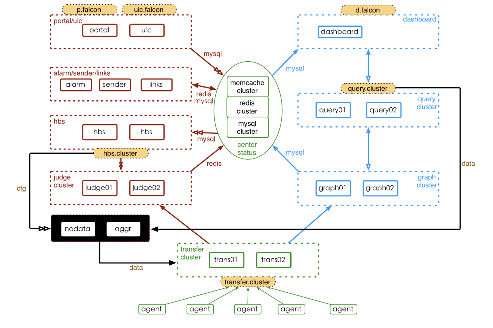

# Open-falcon

## 参考

> http://book.open-falcon.org/zh_0_2/intro/

## 概述

  

## 组件说明

| 编号   | 组件            | 端口                | 水平扩展 | 基础   | 备注               |
| :--- | ------------- | ----------------- | ---- | ---- | ---------------- |
| 1    | agent         | 1988              |      |      |                  |
| 2    | aggregator    | 6055              |      | Y    |                  |
| 3    | alarm         | 9912              | N    | Y    |                  |
| 4    | api           | 8080              |      | Y    |                  |
| 5    | dashboard     | 8081              |      |      |                  |
| 6    | gateway       | 14444/16060/18433 |      |      |                  |
| 7    | graph         | 6070/6071         |      | Y    |                  |
| 8    | hbs           | 6030/6031         |      | Y    |                  |
| 9    | judge         | 6080/6081         |      | Y    |                  |
| 10   | mail-provider | 4000              |      |      | 可以引用外部           |
| 11   | nodata        | 6090              |      | Y    |                  |
| 12   | task          | 8082              |      |      |                  |
| 13   | transfer      | 4444/6060/8433    |      | Y    |                  |
| 14   | ops-meta      |                   |      |      | server:自动更新agent |
| 15   | ops-update    |                   |      |      | agent:自动更新agent  |
| 16   | swcollector   | -                 |      |      | 交换机采集数据          |
| 17   | micadivisor   | -                 |      |      | k8s采集数据          |
|      |               |                   |      |      |                  |

