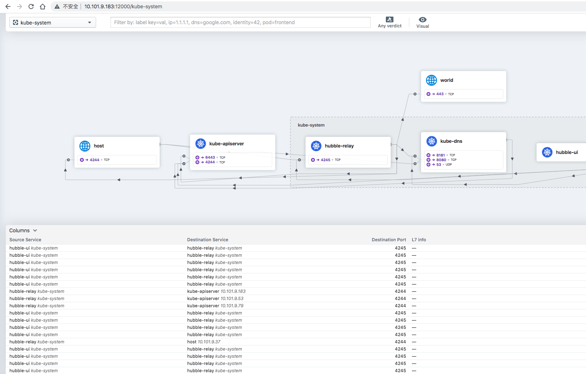

# 实战 | Kubernetes Cluster 快速搭建（基于Cilium）

当前各软件版本

| 名称       | 版本    |
| ---------- | ------- |
| ubuntu     | v22.04  |
| kubernetes | v1.25.0 |
| cilium     | v0.12.2 |
| hubble     | v0.10.0 |

- 这里操作系统选择 `20.04`


## 一、准备资源

### 1.1 VIP

通过 `haproxy` 代理 `apiserver` 多节点

**10.101.9.111**


### 1.2 服务器

| 角色          | 服务器地址   |
| ------------- | ------------ |
| control-plane | 10.101.9.183 |
| control-plane | 10.101.9.53  |
| control-plane | 10.101.9.79  |
| work-node     | 10.101.9.37  |
| work-node     | 10.101.9.1   |
| work-node     | 10.101.9.38  |


## 二、搭建集群

[Reference](kubernetes/01-cluster-init.md)


### 2.1 初始化环境

```bash
curl -s https://books.8ops.top/attachment/kubernetes/bin/01-init.sh | bash
```


### 2.2 调整lib目录

```bash
# containerd
mkdir -p /data1/lib/containerd && \
    ([ -e /var/lib/containerd ] && mv /var/lib/containerd{,-$(date +%Y%m%d)} || /bin/true) && \
    ln -s /data1/lib/containerd /var/lib/containerd
ls -l /var/lib/containerd

# kubelet
mkdir -p /data1/lib/kubelet && \
    ([ -e /var/lib/kubelet ] && mv /var/lib/kubelet{,-$(date +%Y%m%d)} || /bin/true) && \
    ln -s /data1/lib/kubelet /var/lib/kubelet
ls -l /var/lib/kubelet   

# etcd（仅需要在 control-plane）
mkdir -p /data1/lib/etcd && \
    ([ -e /var/lib/etcd ] && mv /var/lib/etcd{,-$(date +%Y%m%d)} || /bin/true) && \
    ln -s /data1/lib/etcd /var/lib/etcd
ls -l /var/lib/etcd
```


### 2.3 安装容器运行时

```bash
CONTAINERD_VERSION=1.5.9-0ubuntu1~20.04.4
apt install -y containerd=${CONTAINERD_VERSION}

apt-mark hold containerd
apt-mark showhold
dpkg -l | grep containerd

# 替换 ctr 运行时
mkdir -p /etc/containerd
containerd config default > /etc/containerd/config.toml-default
cp /etc/containerd/config.toml-default /etc/containerd/config.toml

sed -i 's#sandbox_image.*$#sandbox_image = "hub.8ops.top/google_containers/pause:3.6"#' /etc/containerd/config.toml  
sed -i 's#SystemdCgroup = false#SystemdCgroup = true#' /etc/containerd/config.toml 
grep -P 'sandbox_image|SystemdCgroup' /etc/containerd/config.toml  
systemctl restart containerd
systemctl status containerd
```


### 2.4 安装 kube 环境

```bash
# kubeadm
KUBENETES_VERSION=1.25.0-00
apt install -y -q kubeadm=${KUBENETES_VERSION} kubectl=${KUBENETES_VERSION} kubelet=${KUBENETES_VERSION}
apt-mark hold kubeadm kubectl kubelet
apt-mark showhold
dpkg -l | grep kube

# 用于运行 crictl
cat > /etc/crictl.yaml <<EOF
runtime-endpoint: unix:///run/containerd/containerd.sock
image-endpoint: unix:///run/containerd/containerd.sock
timeout: 10
debug: false
EOF

systemctl restart containerd
crictl images
crictl ps -a

# config
kubeadm config print init-defaults > kubeadm-init.yaml-default

kubeadm config images list -v 5
kubeadm config images list --config kubeadm-init.yaml -v 5
kubeadm config images pull --config kubeadm-init.yaml -v 5

# 初始集群（仅需要在其中一台 control-plane 节点操作）
kubeadm init --config kubeadm-init.yaml --upload-certs -v 5

mkdir -p ~/.kube && ln -s /etc/kubernetes/admin.conf ~/.kube/config 

# 添加节点 control-plane
kubeadm join 10.101.9.111:6443 --token abcdef.0123456789abcdef \
    --discovery-token-ca-cert-hash sha256:2c6210399be45c5d2ecaf37eb37765400bc4f1588b958cf82c9a242e04c6409c \
    --control-plane --certificate-key 379790710e66c402b48abf3476c649f085273c8850e8c0cd31ddb4213373a273

# 添加节点 work-node
kubeadm join 10.101.9.111:6443 --token abcdef.0123456789abcdef \
    --discovery-token-ca-cert-hash sha256:2c6210399be45c5d2ecaf37eb37765400bc4f1588b958cf82c9a242e04c6409c
```

> 编辑 kubeadm-init.yaml

```bash
apiVersion: kubeadm.k8s.io/v1beta3
bootstrapTokens:
- groups:
  - system:bootstrappers:kubeadm:default-node-token
  token: abcdef.0123456789abcdef
  ttl: 24h0m0s
  usages:
  - signing
  - authentication
kind: InitConfiguration
localAPIEndpoint:
  advertiseAddress: 10.101.9.183
  bindPort: 6443
nodeRegistration:
  criSocket: unix:///var/run/containerd/containerd.sock
  imagePullPolicy: IfNotPresent
  name: GAT-LAB-K8S-MASTER-01
  taints: null
---
apiServer:
  timeoutForControlPlane: 4m0s
apiVersion: kubeadm.k8s.io/v1beta3
certificatesDir: /etc/kubernetes/pki
clusterName: kubernetes
controllerManager: {}
dns:
  imageRepository: hub.8ops.top/google_containers
  imageTag: v1.9.3
etcd:
  local:
    dataDir: /var/lib/etcd
imageRepository: hub.8ops.top/google_containers
kind: ClusterConfiguration
kubernetesVersion: 1.25.0
controlPlaneEndpoint: 10.101.9.111:6443
networking:
  dnsDomain: cluster.local
  podSubnet: 172.20.0.0/16
  serviceSubnet: 192.168.0.0/16
scheduler: {}
---
apiVersion: kubelet.config.k8s.io/v1beta1
kind: KubeletConfiguration
cgroupDriver: systemd
---
apiVersion: kubeproxy.config.k8s.io/v1alpha1
kind: KubeProxyConfiguration
mode: ipvs
```


## 三、应用 Cilium

> Reference

- [cilium](https://github.com/cilium/cilium)
- [hubble](https://github.com/cilium/hubble)
- [tingchen](https://tinychen.com/20220510-k8s-04-deploy-k8s-with-cilium/)


### 3.1 工具安装

```bash
# 配置环境
export PATH=~/bin:$PATH
echo 'export PATH=~/bin:$PATH' >> ~/.bashrc

# CILIUM
# https://raw.githubusercontent.com/cilium/cilium-cli/master/stable.txt
CILIUM_VERSION=v0.12.2
curl -sL --remote-name-all https://github.com/cilium/cilium-cli/releases/download/${CILIUM_VERSION}/cilium-linux-amd64.tar.gz{,.sha256sum}
sha256sum --check cilium-linux-amd64.tar.gz.sha256sum
tar xzvfC cilium-linux-amd64.tar.gz ~/bin

cilium hubble enable

# HUBBLE
# https://raw.githubusercontent.com/cilium/hubble/master/stable.txt
HUBBLE_VERSION=v0.10.0
curl -sL --remote-name-all https://github.com/cilium/hubble/releases/download/${HUBBLE_VERSION}/hubble-linux-amd64.tar.gz{,.sha256sum}
sha256sum --check hubble-linux-amd64.tar.gz.sha256sum
tar xzvfC hubble-linux-amd64.tar.gz ~/bin

cilium hubble port-forward &
hubble status
hubble observe
cilium hubble enable --ui # kubectl -n kube-system delete svc hubble-peer
cilium hubble ui &

```

>Output

```bash
root@GAT-LAB-K8S-MASTER-01:~# kubectl -n kube-system get all
NAME                                                READY   STATUS    RESTARTS   AGE
pod/cilium-dwq2w                                    1/1     Running   0          137m
pod/cilium-hlwl6                                    1/1     Running   0          137m
pod/cilium-operator-69b677f97c-ktj47                1/1     Running   0          4h
pod/cilium-t2nwf                                    1/1     Running   0          137m
pod/cilium-tnlbb                                    1/1     Running   0          137m
pod/coredns-b55fcbd7b-ntjg6                         1/1     Running   0          4h16m
pod/coredns-b55fcbd7b-rktpx                         1/1     Running   0          4h16m
pod/etcd-gat-lab-k8s-master-01                      1/1     Running   1          4h16m
pod/etcd-gat-lab-k8s-master-02                      1/1     Running   0          4h15m
pod/etcd-gat-lab-k8s-master-03                      1/1     Running   0          4h14m
pod/hubble-relay-59d8575-hpbl7                      1/1     Running   0          3h18m
pod/hubble-ui-64d4995d57-n7bpq                      2/2     Running   0          136m
pod/kube-apiserver-gat-lab-k8s-master-01            1/1     Running   1          4h16m
pod/kube-apiserver-gat-lab-k8s-master-02            1/1     Running   0          4h15m
pod/kube-apiserver-gat-lab-k8s-master-03            1/1     Running   0          4h14m
pod/kube-controller-manager-gat-lab-k8s-master-01   1/1     Running   1          4h16m
pod/kube-controller-manager-gat-lab-k8s-master-02   1/1     Running   0          4h14m
pod/kube-controller-manager-gat-lab-k8s-master-03   1/1     Running   0          4h14m
pod/kube-proxy-5652c                                1/1     Running   0          4h14m
pod/kube-proxy-bdqfv                                1/1     Running   0          4h16m
pod/kube-proxy-mhtlj                                1/1     Running   0          4h13m
pod/kube-proxy-qtdhk                                1/1     Running   0          4h15m
pod/kube-scheduler-gat-lab-k8s-master-01            1/1     Running   1          4h16m
pod/kube-scheduler-gat-lab-k8s-master-02            1/1     Running   0          4h15m
pod/kube-scheduler-gat-lab-k8s-master-03            1/1     Running   0          4h14m

NAME                   TYPE        CLUSTER-IP        EXTERNAL-IP   PORT(S)                  AGE
service/hubble-peer    ClusterIP   192.168.97.223    <none>        443/TCP                  136m
service/hubble-relay   ClusterIP   192.168.180.202   <none>        80/TCP                   3h18m
service/hubble-ui      ClusterIP   192.168.23.235    <none>        80/TCP                   136m
service/kube-dns       ClusterIP   192.168.0.10      <none>        53/UDP,53/TCP,9153/TCP   4h16m

NAME                        DESIRED   CURRENT   READY   UP-TO-DATE   AVAILABLE   NODE SELECTOR            AGE
daemonset.apps/cilium       4         4         4       4            4           kubernetes.io/os=linux   4h
daemonset.apps/kube-proxy   4         4         4       4            4           kubernetes.io/os=linux   4h16m

NAME                              READY   UP-TO-DATE   AVAILABLE   AGE
deployment.apps/cilium-operator   1/1     1            1           4h
deployment.apps/coredns           2/2     2            2           4h16m
deployment.apps/hubble-relay      1/1     1            1           3h18m
deployment.apps/hubble-ui         1/1     1            1           136m

NAME                                         DESIRED   CURRENT   READY   AGE
replicaset.apps/cilium-operator-69b677f97c   1         1         1       4h
replicaset.apps/coredns-b55fcbd7b            2         2         2       4h16m
replicaset.apps/hubble-relay-59d8575         1         1         1       3h18m
replicaset.apps/hubble-ui-64d4995d57         1         1         1       136m
```


> Hubble UI



### 3.2 Helm 安装

```bash
```


