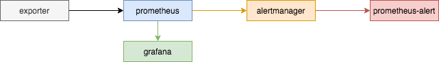

# 实战 | Prometheus 的使用

在《SRE: Google运维解密》一书中指出，监控系统需要能够有效的支持白盒监控和黑盒监控。通过白盒能够了解其内部的实际运行状态，通过对监控指标的观察能够预判可能出现的问题，从而对潜在的不确定因素进行优化。而黑盒监控，常见的如HTTP探针，TCP探针等，可以在系统或者服务在发生故障时能够快速通知相关的人员进行处理。通过建立完善的监控体系，从而达到以下目的：

- 长期趋势分析：通过对监控样本数据的持续收集和统计，对监控指标进行长期趋势分析。例如，通过对磁盘空间增长率的判断，我们可以提前预测在未来什么时间节点上需要对资源进行扩容。
- 对照分析：两个版本的系统运行资源使用情况的差异如何？在不同容量情况下系统的并发和负载变化如何？通过监控能够方便的对系统进行跟踪和比较。
- 告警：当系统出现或者即将出现故障时，监控系统需要迅速反应并通知管理员，从而能够对问题进行快速的处理或者提前预防问题的发生，避免出现对业务的影响。
- 故障分析与定位：当问题发生后，需要对问题进行调查和处理。通过对不同监控监控以及历史数据的分析，能够找到并解决根源问题。
- 数据可视化：通过可视化仪表盘能够直接获取系统的运行状态、资源使用情况、以及服务运行状态等直观的信息。

prometheus是目前人气较高的一款监控软件，活跃的社区吸引了无数的geeker。当然业内常用的监控系统还有nagios、zabbix。

大致原理是数据采集端（exporter）注册到prometheus后，由prometheus周期拉取暴露的metrics。


## 二、单一模式

基于kubernetes




通过helm安装prometheus

```bash
helm repo add prometheus-community https://prometheus-community.github.io/helm-charts
helm repo update
helm search repo prometheus

# prometheus
helm show values prometheus-community/prometheus > prometheus.yaml-default

helm install prometheus prometheus-community/prometheus \
    -f prometheus.yaml \
    -n kube-server \
    --create-namespace \
    --version 15.8.0 --debug
    
helm upgrade --install prometheus prometheus-community/prometheus \
    -f prometheus.yaml \
    -n kube-server \
    --create-namespace \
    --version 15.8.0 --debug

helm -n kube-server uninstall prometheus 
```


> add blackbox-exporter

```bash
# blackbox
helm show values prometheus-community/prometheus-blackbox-exporter > blackbox-exporter.yaml-default

helm install blackbox-exporter prometheus-community/prometheus-blackbox-exporter \
    -f blackbox-exporter.yaml \
    -n kube-server \
    --create-namespace \
    --version 5.6.0 --debug
    
helm upgrade --install blackbox-exporter prometheus-community/prometheus-blackbox-exporter \
    -f blackbox-exporter.yaml \
    -n kube-server \
    --create-namespace \
    --version 5.6.0 --debug

helm -n kube-server uninstall blackbox-exporter 
```


> release persistence

```bash
kubectl edit pv xxx
  finalizers:
  - kubernetes.io/pv-protection
  ...
  # upgraded
  finalizers: []
```


> 让master节点也部署node-exporter

```yaml
...
nodeExporter:
  ...
  tolerations:
    - key: "node-role.kubernetes.io/master"
      operator: "Exists"
```


> edit configmap

```bash
#helm中extraScrapeConfigs未成功
~ $ kubectl -n kube-server edit cm prometheus-server
...
    - job_name: node-instance
      honor_timestamps: true
      scrape_interval: 1m
      scrape_timeout: 10s
      metrics_path: /metrics
      scheme: http
      static_configs:
        - targets:
          - 10.101.11.168:19100
          - 10.101.11.188:19100
          - 10.101.11.197:19100
          - 10.101.11.209:19100
          - 10.101.11.236:19100
    - job_name: 'blackbox-instance'
      metrics_path: /probe
      scheme: http
      params:
        module: [http_2xx]
      static_configs:
        - targets:
          - http://blackbox-exporter-prometheus-blackbox-exporter:9115
      relabel_configs:
        - source_labels: [__address__]
          target_label: __param_target
        - source_labels: [__param_target]
          target_label: instance
        - target_label: __address__
          replacement: blackbox-exporter-prometheus-blackbox-exporter:9115
    alerting: # relative
...          
```


> grafana

```bash
# templ

Kubernetes Cluster 

Kubernetes Cluster (Prometheus)

Kubernetes cluster monitoring (via Prometheus)

Kubernetes Pods (Prometheus)

NGINX Ingress controller

Node Exporter Full


```


> [prometheus-alert-center](https://github.com/feiyu563/PrometheusAlert)

```dockerfile
ARG IMAGE_TAG=1.18-buster
FROM golang:${IMAGE_TAG}

ADD linux /opt

RUN set -ex && \
    chmod +x /opt/PrometheusAlert && \
    ln -snf /usr/share/zoneinfo/Asia/Shanghai /etc/localtime && \
    echo "$TZ" > /etc/timezone

ENTRYPOINT ["/opt/PrometheusAlert"]
```


```bash
# 官方镜像不能发群通知
docker run --rm -d \
	-p 8070:8080 \
	-v /opt/prometheusalert/conf:/app/conf \
	registry.wuxingdev.cn/prometheus/prometheus-alert:v4.8 

# 基于官方二进制可以发
docker build . -t registry.wuxingdev.cn/prometheus/prometheus-alert-center:v4.8
docker run --rm -d \
	-p 8080:8080 \
	-v /opt/prometheusalert/conf:/app/conf \
	registry.wuxingdev.cn/prometheus/prometheus-alert-center:v4.8
	
# 基于二进帛直接运行
8090
```


## 二、联邦模式

多业务集群下独立存在prometheus场景


