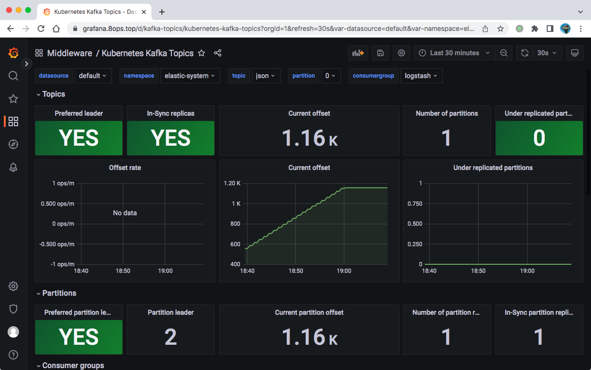

# 实战 | 快速搭建 ELK


## 一、ECK-Operater

Elastic Cloud on Kubernetes

基于kubernetes部署

[Reference](https://www.elastic.co/cn/downloads/elastic-cloud-kubernetes)

```bash
# https://download.elastic.co/downloads/eck/1.2.1/all-in-one.yaml
# https://download.elastic.co/downloads/eck/2.4.0/crds.yaml
# https://download.elastic.co/downloads/eck/2.4.0/operator.yaml
```

[参考](http://icyfenix.cn/appendix/operation-env-setup/elk-setup.html)


> 演示3节点的集群

```bash
# version: 7.17.3

# Example
#   https://books.8ops.top/attachment/elastic/01-persistent-elastic-eck-pv.yaml
#   https://books.8ops.top/attachment/elastic/01-persistent-elastic-eck-pvc.yaml
#   https://books.8ops.top/attachment/elastic/10-eck_crds.yaml-2.4.0
#   https://books.8ops.top/attachment/elastic/10-eck_operator.yaml-2.4.0
#   https://books.8ops.top/attachment/elastic/11-eck-elastic.yaml-7.17.3
#   https://books.8ops.top/attachment/elastic/12-eck-kibana.yaml-7.17.3
#

# 1，安装 ECK 对应的 Operator 资源对象
kubectl apply -f elastic_eck_crds.yaml-2.4.0
kubectl apply -f elastic_eck_operator.yaml-2.4.0

# 2，创建磁盘挂载
kubectl apply -f 01-persistent-elastic-pv.yaml
kubectl apply -f 01-persistent-elastic-pvc.yaml

# 3，创建 elastic 节点
kubectl apply -f 10-elastic.yaml-7.17.3

kubectl port-forward service/quickstart-es-http 5601

## 获取 ES 密码
kubectl get secret quickstart-es-elastic-user -o go-template='{{.data.elastic | base64decode}}' | echo

# 4，创建kibana组件
kubectl apply -f 11-kibana.yaml-7.17.3

kubectl port-forward service/quickstart-kb-http 5601

## 获取 KB 密码
kubectl get secret quickstart-es-elastic-user -o=jsonpath='{.data.elastic}' | base64 --decode; echo

```


## 二、OneKey

基于单机部署

- version: 7.0.1

- method:  docker-compose

```
version: '2.2'
services:
  es-node-01:
    image: docker.elastic.co/elasticsearch/elasticsearch:7.0.1
    container_name: es-node-01
    environment:
      - node.name=es-node-01
      - discovery.seed_hosts=es-node-02
      - cluster.initial_master_nodes=es-node-01,es-node-02
      - cluster.name=es-cluster
      - bootstrap.memory_lock=true
      - "ES_JAVA_OPTS=-Xms4g -Xmx4g"
    ulimits:
      memlock:
        soft: -1
        hard: -1
    ports:
      - 19200:9200
    networks:
      - esnet
  es-node-02:
    image: docker.elastic.co/elasticsearch/elasticsearch:7.0.1
    container_name: es-node-02
    environment:
      - node.name=es-node-02
      - discovery.seed_hosts=es-node-01
      - cluster.initial_master_nodes=es-node-01,es-node-02
      - cluster.name=es-cluster
      - bootstrap.memory_lock=true
      - "ES_JAVA_OPTS=-Xms4g -Xmx4g"
    ulimits:
      memlock:
        soft: -1
        hard: -1
    ports:
      - 29200:9200
    networks:
      - esnet
  es-node-03:
    image: docker.elastic.co/elasticsearch/elasticsearch:7.0.1
    container_name: es-node-03
    environment:
      - node.name=es-node-03
      - discovery.seed_hosts=es-node-01
      - cluster.initial_master_nodes=es-node-01,es-node-02
      - cluster.name=es-cluster
      - bootstrap.memory_lock=true
      - "ES_JAVA_OPTS=-Xms4g -Xmx4g"
    ulimits:
      memlock:
        soft: -1
        hard: -1
    networks:
      - esnet

  es-redis:
    image: redis:5.0.5
    container_name: es-redis
    ports:
      - 16379:6379
    networks:
      - esnet

  es-logstash-01:
    image: docker.elastic.co/logstash/logstash:7.0.1
    container_name: es-logstash-01
    links:
      - es-node-01
      - es-node-02
      - es-redis
    volumes:
      - /data/elk/logstash/pipeline:/usr/share/logstash/pipeline
    networks:
      - esnet

networks:
  esnet:
```


## 三、Helm

[Reference](https://developer.aliyun.com/article/861272)

### 3.1 安全准备

ElasticSearch 7.x 版本默认安装了 X-Pack 插件，并且部分功能免费，这里我们配置安全证书文件。

> 生成证书

```bash
# 运行容器生成证书
docker run --name elastic-charts-certs \
  -i -w /app hub.8ops.top/third/elasticsearch:7.17.3 \
  /bin/sh -c "elasticsearch-certutil ca --out /app/elastic-stack-ca.p12 --pass '' && elasticsearch-certutil cert --name security-master --dns security-master --ca /app/elastic-stack-ca.p12 --pass '' --ca-pass '' --out /app/elastic-certificates.p12"

# 从容器中将生成的证书拷贝出来
docker cp elastic-charts-certs:/app/elastic-certificates.p12 ./ 

# 删除容器
docker rm -f elastic-charts-certs

# 将 pcks12 中的信息分离出来，写入文件
openssl pkcs12 -nodes -passin pass:'' \
  -in elastic-certificates.p12 \
  -out elastic-certificate.pem
```

> 添加证书到集群

```bash
# 添加证书
kubectl -n elastic-system create secret generic elastic-certificates \
  --from-file=lib/elastic-certificates.p12
kubectl -n elastic-system create secret generic elastic-certificate-pem \
  --from-file=lib/elastic-certificate.pem

# 设置集群用户名密码，用户名不建议修改
kubectl -n elastic-system create secret generic elastic-credentials \
  --from-literal=username=elastic --from-literal=password=ops@2022
  
kubectl -n elastic-system create secret generic kibana \
  --from-literal=encryptionkey=zGFTX0cy3ubYVmzuunACDZuRj0PALqOM
```

尝试启动xpack资料

- https://github.com/elastic/helm-charts/tree/7.17/kibana/examples/security


### 3.2 安装

> elasticsearch

```bash
helm repo add elastic https://helm.elastic.co
helm repo update elastic

helm search repo elastic
helm show values elastic/elasticsearch --version 7.17.3 > elasticsearch.yaml-7.17.3

# Example
#   https://books.8ops.top/attachment/elastic/01-persistent-elastic-cluster.yaml
#   https://books.8ops.top/attachment/elastic/helm/elastic-cluster-master.yaml-7.17.3
#   https://books.8ops.top/attachment/elastic/helm/elastic-cluster-data.yaml-7.17.3
#   https://books.8ops.top/attachment/elastic/helm/elastic-cluster-client.yaml-7.17.3
#

# master 节点
helm upgrade --install elastic-cluster-master elastic/elasticsearch \
    -f elastic-cluster-master.yaml-7.17.3 \
    -n elastic-system\
    --version 7.17.3

# data 节点
helm upgrade --install elastic-cluster-data elastic/elasticsearch \
    -f elastic-cluster-data.yaml-7.17.3 \
    -n elastic-system\
    --version 7.17.3

# client 节点
helm upgrade --install elastic-cluster-client elastic/elasticsearch \
    -f elastic-cluster-client.yaml-7.17.3 \
    -n elastic-system\
    --version 7.17.3

#### 
# 尝试关闭 xpack.security.enabled 
# 
kubectl -n elastic-system delete pvc elastic-cluster-data-elastic-cluster-data-0 elastic-cluster-data-elastic-cluster-data-1 elastic-cluster-data-elastic-cluster-data-2 elastic-cluster-master-elastic-cluster-master-0 elastic-cluster-master-elastic-cluster-master-1 elastic-cluster-master-elastic-cluster-master-2


```


> kibana

```bash
helm search repo kibana
helm show values elastic/kibana --version 7.17.3 > kibana.yaml-7.17.3

# Example
#   https://books.8ops.top/attachment/elastic/helm/kibana.yaml-7.17.3
# 

helm upgrade --install kibana elastic/kibana \
    -f kibana.yaml-7.17.3 \
    -n elastic-system \
    --version 7.17.3
```


> filebeat

[Reference](https://www.elastic.co/guide/en/beats/filebeat/current/configuring-howto-filebeat.html)

```bash

# Example: demo.out --> filebeat --> elasticsearch --> kibana
#   https://books.8ops.top/attachment/elastic/50-filebeat-demo.yaml
# 

# ---
helm search repo filebeat
helm show values elastic/filebeat --version 7.17.3 > filebeat.yaml-7.17.3.default

```


> kafka

[Reference](https://kafka.apache.org/)

```bash
# Example
#   https://github.com/bitnami/containers/tree/main/bitnami/kafka
#   
#   https://books.8ops.top/attachment/elastic/helm/kafka.yaml-19.0.1
#   

helm repo update bitnami
helm search repo kafka
helm show values bitnami/kafka --version 19.0.1 > kafka.yaml-19.0.1.default

helm upgrade --install kafka bitnami/kafka \
    -f kafka.yaml-19.0.1 \
    -n elastic-system \
    --version 19.0.1

# --------------------------------------------- #
# usage
kubectl run kafka-client --restart='Never' \
  --image hub.8ops.top/bitnami/kafka:3.3.1-debian-11-r1 \
  --namespace elastic-system --command -- sleep infinity

kubectl exec --tty -i kafka-client --namespace elastic-system -- bash

## PRODUCER:
kafka-console-producer.sh \
    --broker-list kafka-0.kafka-headless.elastic-system.svc.cluster.local:9092 \
    --topic test

## CONSUMER:
kafka-console-consumer.sh \
    --bootstrap-server kafka.elastic-system.svc.cluster.local:9092 \
    --topic test \
    --from-beginning
```





> logstash

```bash
# Example
#   https://books.8ops.top/attachment/elastic/helm/logstash.yaml-7.17.3
#   

helm search repo logstash
helm show values elastic/logstash --version 7.17.3 > logstash.yaml-7.17.3-default

helm upgrade --install logstash elastic/logstash \
    -f logstash.yaml-7.17.3 \
    -n elastic-system \
    --version 7.17.3


```


## 四、常用实践

### 4.1 容器环境收集日志方案

| **方案**                                                     | **优点**                                                     | **缺点**                                                   |
| ------------------------------------------------------------ | ------------------------------------------------------------ | ---------------------------------------------------------- |
| 每个app的镜像中都集成日志收集组件<br />或由app镜像直接将信息推送到采集端 | 部署方便，kubernetes的yaml文件无须特别配置，可以为每个app自定义日志收集配置 | 强耦合，不方便应用和日志收集组件升级和维护且会导致镜像过大 |
| 单独创建一个日志收集组件跟app的容器一起运行在同一个pod中     | 低耦合，扩展性强，方便维护和升级                             | 需要对kubernetes的yaml文件进行单独配置，略显繁琐           |
| 将所有的Pod的日志都挂载到宿主机上，每台主机上单独起一个日志收集Pod | 完全解耦，性能最高，管理起来最方便                           | 需要统一日志收集规则，目录和输出方式                       |


